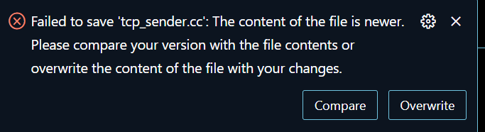
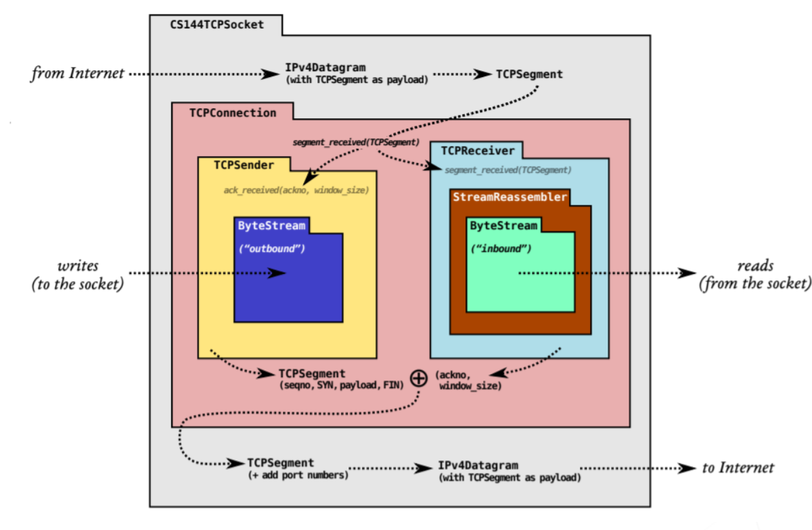

# 计算机网络学习总结

## 中科大计算机网络

### 课程介绍

应该是为数不多的比较好的中文计算机网课，教授内容为计算机网络，授课顺序和《计算机网络（自顶而下方法）》一致，但没有配套作业(指lab)，有习题，也有习题讲解课；教授这门课的是中科大的郑烇、杨坚老师

b站链接：[中科大郑烇、杨坚全套《计算机网络（自顶向下方法 第7版，James F.Kurose，Keith W.Ross）》](https://www.bilibili.com/video/BV1JV411t7ow/?spm_id_from=333.337.search-card.all.click&vd_source=865125835ff76711e37999adb58966b2) 

Youtube链接：[计算机网络-中国科学技术大学](https://www.youtube.com/watch?v=V3e55f1HsPk&list=PLaYSsAWtQBi6fuckA3voWYQXJz3ESw_OA) 

### 时间安排

好像是学了一个多月，在上学期间；假期的话可能会快一点😀

### 上课经验及体会

1. 中文网课为数不多的好课，b友们记得一键三连🥺
2. 虽然是中文网课，但我后续还是在Youtube上看了；b站旁边的这个推送看着很烦，而且b站的记忆视频进度很奇怪，所以有和我一样特殊需求的可以转战Youtube
3. 每个视频前面都有个动画，动画的声音很大，b站好像又跳不掉这个片头，所以每次要上课的时候记得事先调低声音☹
4. 毕竟是中文网课，不开倍速对不起母语；个人感觉1.5倍速比较合适；2倍速快了点，对注意力有要求，否则就会老走神（~~跟我一样~~）
5. 授课内容很广泛，几乎涵盖了《自顶而下方法》的所有内容，但并不失深度；但限于课程时长，很多东西都是浅尝辄止，只是让学生了解大致有这么个东西；感觉是比较适合当计网的第一个课程，本身就由于计网内容广且深
6. 就找工方面，其实个人认为学这门课的意义不算很大，课程中非常多的底层内容，只有一小部分关注于和找工关系密切的传输层内容，可能适合拿来复习考研（？）
7. 科大女生果然少，仅存的少数女生基本都被包围在第一二排👀  ~~好吧玉泉也不多~~🤡
8. 计网里面很多的英文名词，用中文说的话就感觉比较奇怪，不那么直观形象，有种违和感；所以虽然我上了这门中文网课，但还是建议大家去上英文的网课，当然主要原因是我找不到好的计网英文课
9. 原来Cisco是Stanford的[Leonard Bosack](https://en.wikipedia.org/wiki/Leonard_Bosack) & [Sandy Lerner](https://en.wikipedia.org/wiki/Sandy_Lerner) 夫妇共同创立的🤗好强
10. 感觉学完这门课，可以去选一下通识课《无线网络应用》，收获会更大

## Stanford CS144

### 课程介绍

CS144是Stanford的计算机网络课程，网课视频和project均向大众开放；貌似CS144的网课不是很好（详见胡神的[CS144: 什么，你学不会TCP？那就来自己写一个吧！](https://zhuanlan.zhihu.com/p/175998415) ）所以就只选择做了CS144久负盛名的project  `TCP复现`

### 时间安排

只做了lab0~4，总共做了两周多；但其实应该是可以更快一点，有个lab想得太过复杂，实现起来非常麻烦，但事实上相对简单

### Project通关tips

1. 我没有找到CS144  20fa的官方repo，所以最终选择了GitHub上别人已经做过的repo进行回退，貌似20fa和21fa的差别不是很大，任选其一即可；每做完一个lab再 `git cherry-pick`，不要直接回退到lab7的starter code 

2. 实验环境方面，我选择直接用官方给的 Virtualbox 镜像文件，再用VSCode ssh到虚拟机进行开发；但是请注意，Virtualbox的共享文件夹功能太过鸡肋，所以不要用！应该直接在虚拟机中`git pull` repo，随之而来的问题就是需要让虚拟机科学上网，但是这方面笔者不好细说，望大家各显神通；另一种选择是在CLion中ssh到虚拟机，再用CLion的共享功能，笔者没试过，但应该可行；当然不用官方的Virtualbox应该也行，不过遇到的网络问题可能会不一而足🤔

3. 在使用VSC连接虚拟机开发的过程中，不要下VSC的`C++ Extension Pack` 插件，想要有C++的语法提示就只下一个`C/C++` 的插件，否则就会这样😥VIrtualBox鸡肋的另一点就是，他不能调整VM的存储空间大小，所以这个坑花费了很多时间

   

4. 虚拟机中有些东西也没有事先配好，缺少的东西需要自己 ` sudo apt install` ，所以当看到头文件之类的报错，先怀疑是环境的问题

5. 虽然说Project里说要使用C++的现代特性，但其实用的也不多，不了解关系也不会非常大；但最好还是要有一点C++现代特性的了解，否则有些不符合现代特性的代码即使是正确的，也无法通过编译（比如在Constructor里要用的Initialization list）（貌似是因为Makefile中的cflag给了effc++11的缘故) ；对于C++的现代特性，可以上一上Stanford的CS106L，详见笔者的 [C++自学总结](https://www.cc98.org/topic/5550820) 

6. 整个lab是从底部开始搭建，从lab1的StreamReassembler，lab2的TCP Receiver再到lab3的TCPSender和最终将lab1、2、3合并的lab4 TCPConnection，实现一个能实现可靠传输、乱序字节流重排及缓存、超时重传、快速重传、流量控制、拥塞控制、连接管理等功能的TCP

   

   

7. lab1不需要想得过于复杂，~~否则就会和我一样写四五天都写不出来~~ 🤡 lab1的思路，我的和[CS144计算机网络 Lab1 | Kiprey's Blog](https://kiprey.github.io/2021/11/cs144-lab1/) 是一样的

8. 很多东西其实lab的指导书里讲得不够清楚，很多东西需要去看testcase才能理解

9. lab1、2、3的testcase不够全，当lab4把所有前面做过的lab合并起来的时候，非常全面的lab4 testcase会暴露之前lab的bug

10. 尽量多用引用类型`&` ，因为lab自身给的一些Class不够完善，一些destructor没有释放该释放的内存，~~导致我最终找到在lab4的memory leak的bug非常想骂人~~ 😢

11. debug方面，用的是gdb来debug，注意把`etc/cflag.cmake` 文件中的`-Og` 换成 `-O0` ，否则gdb会跳过一些代码

12. 实验方面，做过这个proj的大佬很多，公开的blog也很多，我主要参考的是 [CS144计算机网络|Kiprey's Blog](https://kiprey.github.io/2021/11/cs144-lab0/)       感谢🥰         ps：希望大家做自己blog的时候，少弄些花哨的效果，不然读起来确实挺累的🤡

## 总结

虽然照理来说应该是学完OS再去学网络，但其实感觉网络是比较独立的一门课，所以其实感觉什么时候学都可以；网络还是比较有趣的，而且内容很广很广，做硬件的，做软件的都能在网络里找到自己擅长的地方；当然，~~学完计网也可以对科学上网有了进一步的了解~~